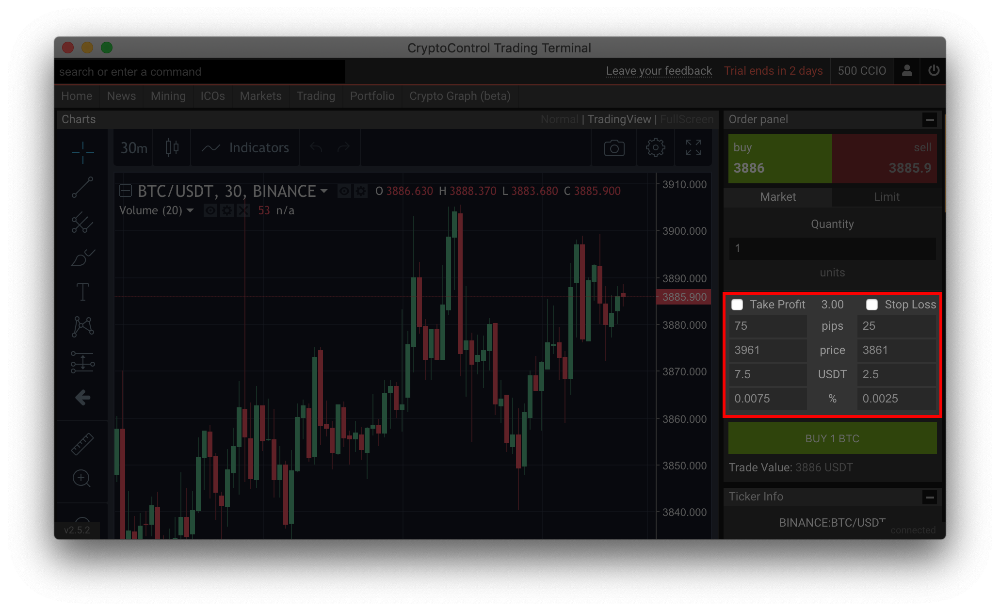
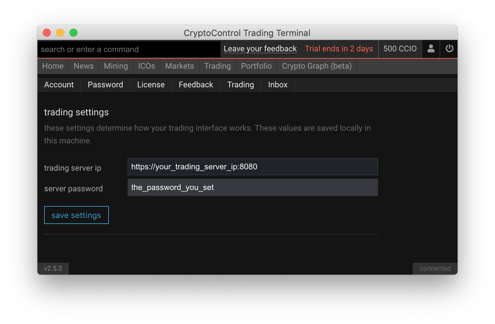

Algo Trading Server for Advanced Orders
=======================================

This server is meant to be used by the CryptoControl Terminal to execute advanced orders like stop-losses, trailing stop-losses, take profit (and more) on exchanges that don't support advanced orders.

In the screenshot below, users have the ability to execute stop-loss and take-profit orders from the trading screen within the CryptoControl Terminal, on an exchange that doesn't support these kinds of orders.



The CryptoControl Terminal allows users to host their own trading servers so that they can execute advanced orders from within the terminal itself but never expose their API keys to CryptoControl. Since the trading server is open-source, everything is transparent.

For a quick start with docker-compose run
```
docker-compose up
```
or via docker, run
```
docker run -p 8080:8080 -e SERVER_SECRET=set_random_password_here cryptocontrol-trading-server
```

## Disclaimer
**USE THE SOFTWARE AT YOUR OWN RISK. YOU ARE RESPONSIBLE FOR YOUR OWN MONEY.**
**THE AUTHORS AND ALL AFFILIATES ASSUME NO RESPONSIBILITY FOR YOUR USE OF THIS SOFTWARE.**

## Usage
Host this server in your own machine and enter in the server's ip and password in the CryptoControl's trading's settings screen as shown below.



Once set, you'll be able to execute advanced orders straight from your terminal.


<!-- ## How advanced orders work
To execute advanced orders, a server needs to be running 24x7 monitoring the price feeds of various exchanges and executing trades automatically when certain conditions are met.

Some exchanges have a real-time api (websocket or FIX) for trades which allow  -->

## Authentication
The trading server uses [JWT](https://jwt.io/) to authenticate users. The JWT's secret key is taken from the environment variable `SERVER_PASSWORD`. The JWT token must be passed via the `x-jwt` header and is automatically sent from the CryptoControl terminal.

## Storage of API keys
All API keys are stored in a json file in the `./storage` folder which is encrypted with the `SERVER_PASSWORD` environment variable. If you change the secret, you'll have to re-enter your API keys. API keys once uploaded cannot be viewed again by the client.

## Supported Strategies
As of now, the trading server supports
- Stop Loss
- Take Profit
- Trailing Take Profit

## Supported Exchanges
The following exchanges are supported: Binance, Bittrex

## Upcoming Features
For any suggestions on features that you'd like to see, let us know by either submitting an issue or writing to us at contact@cryptocontrol.io

Some of the upcoming features that we're working on include:

- AI Integration
- HFT (High Frequency Trading)
- Custom Strategies
